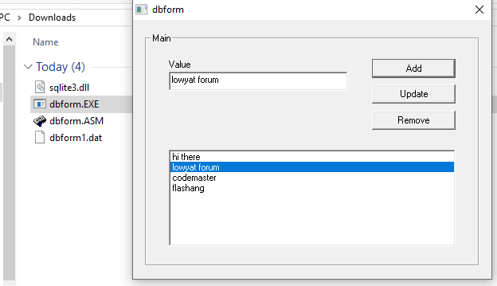

# dbform
My first database program in Assembly language, based on SQLite3

> [!NOTE]
> This program has bugs (see below).

My last notable hobby project in 2025 was a Win32 database program written in FASM, based on SQLite3.dll.

It allows CRUD, but I have issue with Update and Remove in indexing if you start remove items in the middle of the list, it won't update the database although it appears correctly in GUI window.

SQLite3.dll is decades old, I got the example and file from another fellow Malaysian "yeohhs", who had uploaded several FASM tutorial examples.

The code to fetch SELECT query in my program is different than what I did last time in Visual Basic 6, the result set returned by `sqlite3_get_table` function is in memory pointer format, and the first row is always column header. If I have two columns, then each cell is 4-byte long (memory address), which mean each row is 8-byte long.

Nonetheless, it was fun to program a SQL database program in Assembly language. If you are in Developer Kaki group, you may already see I have showcased this in July 2025.

If you want to run, here's how:
1. Download `dbform.asm` and `sqlite3.dll`
2. Download Flat Assembler for Windows
3. Run FASMW.EXE and open `dbform.asm`
4. Click Compile (or Run)
5. Please make sure `sqlite3.dll` and `dbform.exe` are in the same directory
6. After you run, you'll notice `dbform1.dat` file-based database is created
